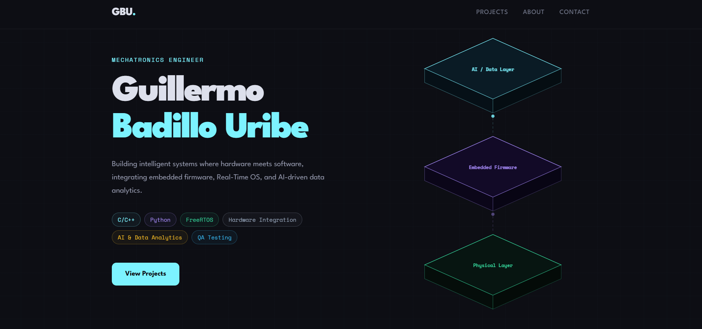
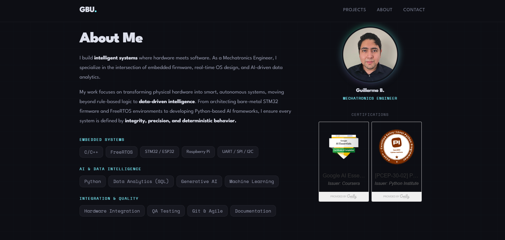

# GBU-Portfolio

A visually striking, highly optimized personal portfolio website engineered with a dark, low-light aesthetic. This project showcases the intersection of embedded engineering, real-time operating systems, software validation, and data intelligence.

Designed to act as a digital hub for technical expertise, it features interactive project filtering, a responsive multi-column layout, and deep integration of custom SVG system architecture vector diagrams.

The production deployment is hosted on a custom apex domain at **[guillermobadillo.com](https://guillermobadillo.com)**, routed and secured utilizing advanced Cloudflare edge networking infrastructure.

> **Core Concepts**: Front-End Engineering, Responsive Layout Design, Interactive DOM Manipulation, Cloud Edge Routing, DNS Management & Security, Low-Light UX Architecture, Component Lifecycle Optimization.
tion.

---
## 📸 Interface

  

  

---

## Features

- **Dark Engineering UX Aesthetic**: Designed with an ultra-sleek, low-light color palette (`#0d0e14`) paired with precise cyber-neon accents (`#7CF3FF`, `#A78BFA`, `#34D399`) to mirror an integrated development environment (IDE) feel.
- **Dynamic Project Filtering Engine**: Client-side filtering written in native, vanilla JavaScript allowing users to seamlessly toggle featured projects across categories (Firmware Development, Python Development, Data Analysis) without page reloads.
- **Isometric System Architecture Graphic**: Houses a custom inline SVG displaying a three-layer isometric system platform (AI/Data Layer, Embedded Firmware, and Physical Layer) to instantly communicate domain alignment.
- **Robust Failure Fallbacks**: Implements robust inline `onerror` handling for missing local profile pictures and project thumbnails, dynamically injecting clean, stylized vector placeholders to preserve structural alignment.
- **Asynchronous Badge Integration**: Deep integration with external verified certification assets (Credly) via asynchronous script delivery, allowing automated cross-platform credential presentation.
- **Fluid Layout & High-Performance Transitions**: Leverages the CSS `IntersectionObserver` API to orchestrate scroll-driven entry animations (`fadeUp`, `in-view`) and layout updates without causing page lag or layout shifts.

---

## Architecture

### Data & Presentation Pipeline
The interface is constructed using a decoupled layout structure ensuring that design presentation never interferes with informational content accessibility:

- **Semantic Document Hierarchy**:
  - Leverages structural HTML5 landmarks (`<header>`, `<section>`, `<article>`, `<footer>`) to promote search-engine visibility and screen-reader accessibility.
  - Implements clean, scalable font rendering via variable typography configurations using clamp bounds (`clamp(2.8rem, 6vw, 5rem)`) for seamless responsiveness.

- **Asynchronous Scroll Optimization**:
  - Uses native CSS `position: sticky` on the navigation bar and professional summary sidebar to guarantee accessible interaction anchor points regardless of vertical displacement.
  - Features a lightweight client-side scroll observer that dynamically mutates classes on elements entering the viewport, decoupling state changes from rendering execution loops.

- **Responsive Breakdown Matrix**:
  - **Desktop Layout (>900px)**: Grid configurations optimizing reading tracking across text-heavy project items and dense professional summaries.
  - **Tablet Layout (≤900px)**: Graceful structural transformation moving the summary sidebar into a horizontal item grid beneath the text elements.
  - **Mobile Layout (≤768px)**: Complete single-column vertical stack collapsing complex inline margins and tracking elements, automatically re-scaling data badges down via hardware-accelerated transform scaling matrices.

### Environment & Network Infrastructure
1. **Isolated Variable Scopes**: All critical design configurations (colors, fonts, radii, transitions) are declared globally inside the CSS `:root` scope, ensuring global modular changes take effect instantly across components.
2. **Cloudflare Proxy Routing**: The domain zone file for `guillermobadillo.com` uses proxy status rules to run traffic through Cloudflare's network edges, enabling immediate global distribution, automatic HTTPS redirection (HSTS), and resource minification options.
3. **Deterministic Layout Calculations**: Uses explicit `box-sizing: border-box` styling globally to protect elements from unexpected padding overflows and preserve absolute multi-device layout integrity.

---

📬 **Contact** 
If you have any questions:  
📧 [badillouribeguillermoca@gmail.com](mailto:badillouribeguillermoca@gmail.com)  
🔗 [LinkedIn](https://www.linkedin.com/in/guillermo-badillo-uribe-382301228/)   

📄 **License** 
This repository is licensed under the MIT License.
